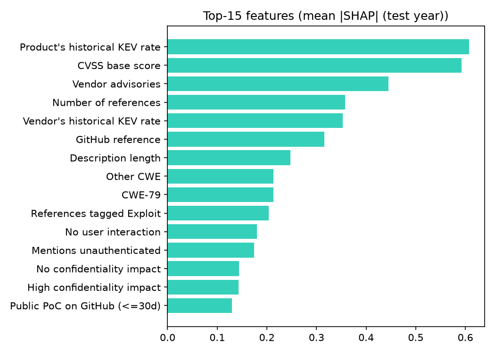
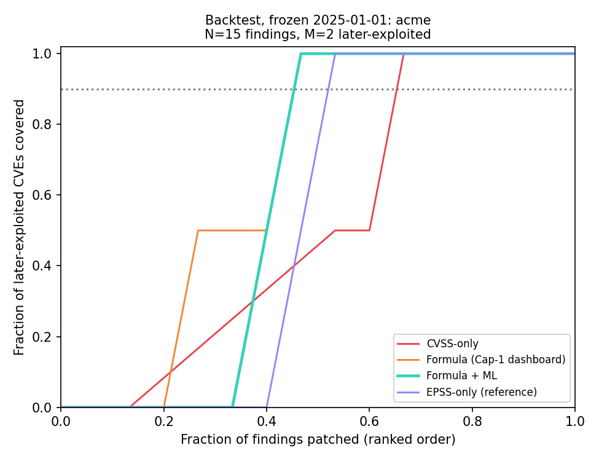
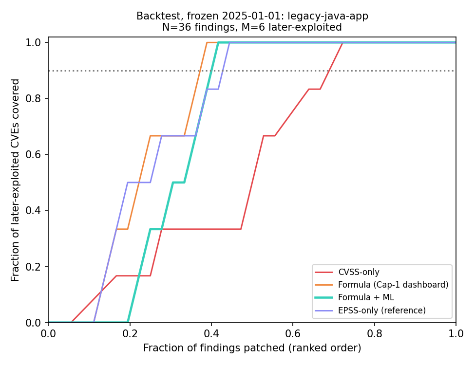
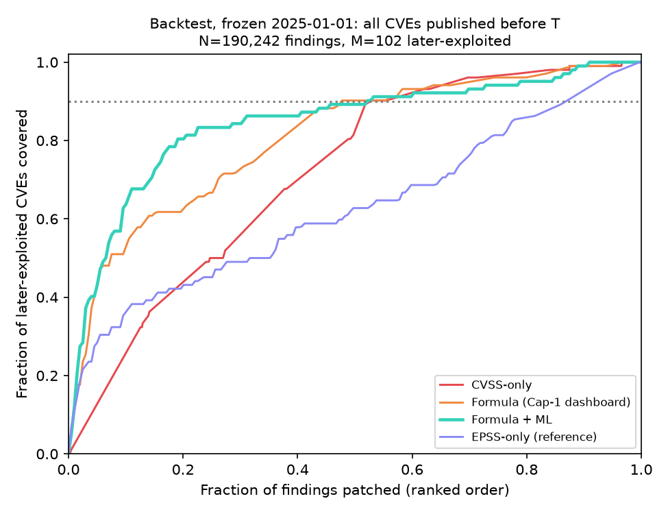

# Results

Model: `lightgbm`, trained 2026-09-21; data source `public-feeds`; KEV catalogue 2026.09.18; EPSS scores of 2026-09-21.

Split by NVD published date: train 108,024 CVEs (784 KEV), validate 39,944 (160), test 47,969 (197, 0.41%).

## Table 1 — Classifier vs baselines, 2025 test year (n=47,969, k=197 in KEV)

| Ranker | AUC-ROC | PR-AUC | Precision@100 | Recall@1000 | Effort to cover 90% |
| --- | --- | --- | --- | --- | --- |
| CVSS base score | 0.763 | 0.016 | 0.086 | 0.124 | 60.0% |
| EPSS (FIRST) | 0.972 | 0.464 | 0.690 | 0.665 | 5.0% |
| Our model, without EPSS | 0.916 | 0.215 | 0.410 | 0.497 | 24.6% |
| Our model, with EPSS | 0.984 | 0.549 | 0.730 | 0.802 | 3.9% |
| Logistic regression (explainability baseline) | 0.919 | 0.128 | 0.260 | 0.442 | 20.8% |
| Our model + time features (diagnostic) | 0.891 | 0.078 | 0.250 | 0.339 | 36.0% |

EPSS rows use the current EPSS file (already informed by post-publication exploitation): an optimistic upper bound. Metrics are expected values under random tie-breaking.

## Table 2 — Backtest, frozen 2025-01-01

Answer key: CISA KEV rows with dateAdded > 2025-01-01. Frozen model `lightgbm` trained on 2019-2023 with labels as of the freeze date (730 positives), 5-fold cross-fitted.

### acme: acme-commerce-platform — N=14 findings, M=0 later-exploited, 5 already in KEV

| Ranking method | Mean rank of later-exploited | Precision@10 | Precision@25 | Effort to cover 90% |
| --- | --- | --- | --- | --- |
| CVSS-only | n/a | 0.000 | 0.000 | n/a |
| Formula (Cap-1 dashboard) | n/a | 0.000 | 0.000 | n/a |
| Formula + ML | n/a | 0.000 | 0.000 | n/a |
| EPSS-only (reference) | n/a | 0.000 | 0.000 | n/a |
| ML probability only (diagnostic) | n/a | 0.000 | 0.000 | n/a |

### legacy-java-app: struts2-showcase — N=36 findings, M=0 later-exploited, 9 already in KEV

| Ranking method | Mean rank of later-exploited | Precision@10 | Precision@25 | Effort to cover 90% |
| --- | --- | --- | --- | --- |
| CVSS-only | n/a | 0.000 | 0.000 | n/a |
| Formula (Cap-1 dashboard) | n/a | 0.000 | 0.000 | n/a |
| Formula + ML | n/a | 0.000 | 0.000 | n/a |
| EPSS-only (reference) | n/a | 0.000 | 0.000 | n/a |
| ML probability only (diagnostic) | n/a | 0.000 | 0.000 | n/a |

### population: all CVEs published before the freeze date — N=190,242 findings, M=102 later-exploited, 1101 already in KEV

| Ranking method | Mean rank of later-exploited | Precision@10 | Precision@25 | Effort to cover 90% |
| --- | --- | --- | --- | --- |
| CVSS-only | 54075.6 | 0.000 | 0.000 | 52.4% |
| Formula (Cap-1 dashboard) | 36519.1 | 0.000 | 0.000 | 47.3% |
| Formula + ML | 29714.0 | 0.000 | 0.000 | 51.9% |
| EPSS-only (reference) | 71218.7 | 0.000 | 0.000 | 86.9% |
| ML probability only (diagnostic) | 30343.4 | 0.000 | 0.000 | 47.7% |

## Table 3 — Ablation on Formula + ML (effort to cover 90%)

| Signal removed | acme | legacy-java-app | population |
| --- | --- | --- | --- |
| None (full Formula + ML) | n/a | n/a | 51.9% (+0.0 pp) |
| ML probability | n/a | n/a | 68.2% (+16.3 pp) |
| EPSS | n/a | n/a | 49.5% (-2.4 pp) |
| KEV flag | n/a | n/a | 51.9% (-0.0 pp) |
| Blast radius (fan-in) | n/a | n/a | n/a |
| Scope multiplier | n/a | n/a | 51.5% (-0.4 pp) |
| Asset criticality | n/a | n/a | n/a |

A positive change means removing the signal made the ranking worse (more patching needed). A negative change means the signal hurt on this case and should be reported as such.

> The primary SBOM has fewer than 5 later-exploited CVEs; quote the population case for statistical claims.
