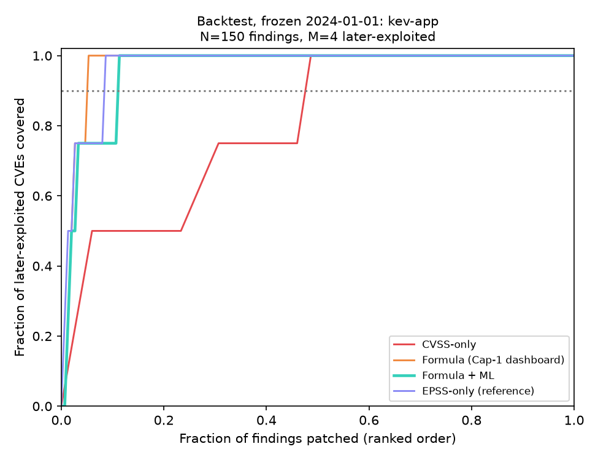

# Results

Model: `lightgbm`, trained 2026-09-24; data source `public-feeds`; KEV catalogue 2026.09.23; EPSS scores of 2026-09-23.

Split by NVD published date: train 108,024 CVEs (784 KEV), validate 39,944 (160), test 47,969 (197, 0.41%).

## Table 1 — Classifier vs baselines, 2025 test year (n=47,969, k=197 in KEV)

| Ranker | AUC-ROC | PR-AUC | Precision@100 | Precision@500 | Recall@1000 | Effort to cover 90% |
| --- | --- | --- | --- | --- | --- | --- |
| CVSS base score | 0.765 | 0.017 | 0.086 | 0.038 | 0.125 | 60.0% |
| EPSS (FIRST) | 0.972 | 0.464 | 0.690 | 0.230 | 0.665 | 5.0% |
| Our model, without EPSS | 0.915 | 0.200 | 0.380 | 0.148 | 0.467 | 25.6% |
| Our model, with EPSS | 0.983 | 0.548 | 0.720 | 0.286 | 0.807 | 3.8% |
| Logistic regression (explainability baseline) | 0.920 | 0.128 | 0.260 | 0.094 | 0.442 | 20.7% |
| Our model + time features (diagnostic) | 0.921 | 0.231 | 0.420 | 0.180 | 0.543 | 23.0% |

EPSS rows use the current EPSS file (already informed by post-publication exploitation): an optimistic upper bound. Metrics are expected values under random tie-breaking.

## Table 2 — Backtest, frozen 2024-01-01

Answer key: CISA KEV rows with dateAdded > 2024-01-01. Frozen model `lightgbm` trained on 2019-2022 with labels as of the freeze date (553 positives), 5-fold cross-fitted.

### acme: acme-commerce-platform — N=14 findings, M=0 later-exploited, 5 already in KEV

| Ranking method | Mean rank of later-exploited | Precision@10 | Precision@25 | Effort to cover 50% | Effort to cover 75% | Effort to cover 90% |
| --- | --- | --- | --- | --- | --- | --- |
| CVSS-only | n/a | 0.000 | 0.000 | n/a | n/a | n/a |
| Formula (Cap-1 dashboard) | n/a | 0.000 | 0.000 | n/a | n/a | n/a |
| Formula + ML | n/a | 0.000 | 0.000 | n/a | n/a | n/a |
| EPSS-only (reference) | n/a | 0.000 | 0.000 | n/a | n/a | n/a |
| ML probability only (diagnostic) | n/a | 0.000 | 0.000 | n/a | n/a | n/a |

Open findings only (5 already-in-KEV findings removed, N=9):

| Ranking method | Mean rank of later-exploited | Precision@10 | Precision@25 | Effort to cover 50% | Effort to cover 75% | Effort to cover 90% |
| --- | --- | --- | --- | --- | --- | --- |
| CVSS-only | n/a | 0.000 | 0.000 | n/a | n/a | n/a |
| Formula (Cap-1 dashboard) | n/a | 0.000 | 0.000 | n/a | n/a | n/a |
| Formula + ML | n/a | 0.000 | 0.000 | n/a | n/a | n/a |
| EPSS-only (reference) | n/a | 0.000 | 0.000 | n/a | n/a | n/a |
| ML probability only (diagnostic) | n/a | 0.000 | 0.000 | n/a | n/a | n/a |

### kev-app: kev-app — N=150 findings, M=4 later-exploited, 1 already in KEV

*Constructed validation fixture, not a real application: 5 package versions pinned to 4 CVEs that CISA added to KEV after 2024-01-01, selected from OSV affected-version data; the SBOM and scan are genuine Syft and Trivy output over those manifests, and the dependency tree is one level deep.*

| Ranking method | Mean rank of later-exploited | Precision@10 | Precision@25 | Effort to cover 50% | Effort to cover 75% | Effort to cover 90% |
| --- | --- | --- | --- | --- | --- | --- |
| CVSS-only | 30.6 | 0.200 | 0.080 | 4.4% | 27.3% | 47.7% |
| Formula (Cap-1 dashboard) | 4.2 | 0.400 | 0.160 | 2.0% | 2.7% | 5.3% |
| Formula + ML | 6.2 | 0.300 | 0.160 | 2.0% | 3.3% | 10.0% |
| EPSS-only (reference) | 5.0 | 0.300 | 0.160 | 1.3% | 2.7% | 8.7% |
| ML probability only (diagnostic) | 15.8 | 0.300 | 0.120 | 1.3% | 3.3% | 36.7% |

Open findings only (1 already-in-KEV findings removed, N=149):

| Ranking method | Mean rank of later-exploited | Precision@10 | Precision@25 | Effort to cover 50% | Effort to cover 75% | Effort to cover 90% |
| --- | --- | --- | --- | --- | --- | --- |
| CVSS-only | 29.9 | 0.200 | 0.080 | 4.0% | 26.8% | 47.3% |
| Formula (Cap-1 dashboard) | 3.2 | 0.400 | 0.160 | 1.3% | 2.0% | 4.7% |
| Formula + ML | 5.2 | 0.300 | 0.160 | 1.3% | 2.7% | 9.4% |
| EPSS-only (reference) | 4.5 | 0.300 | 0.160 | 1.3% | 2.0% | 8.1% |
| ML probability only (diagnostic) | 15.5 | 0.300 | 0.120 | 1.3% | 3.4% | 36.2% |

Excluded (published after the freeze date): CVE-2023-49657, CVE-2024-23897, CVE-2024-24772, CVE-2024-24773, CVE-2024-24779, CVE-2024-26016, CVE-2024-27315, CVE-2024-28148, CVE-2024-34693, CVE-2024-39887, CVE-2024-43044, CVE-2024-43045, CVE-2024-47803, CVE-2024-47804, CVE-2024-53947, CVE-2024-53948, CVE-2024-53949, CVE-2024-55633, CVE-2025-27622, CVE-2025-27623, CVE-2025-27624, CVE-2025-27625, CVE-2025-27696, CVE-2025-31720, CVE-2025-31721, CVE-2025-48912, CVE-2025-55672, CVE-2025-55673, CVE-2025-55674, CVE-2025-55675, CVE-2025-59474, CVE-2025-59475, CVE-2025-59476, CVE-2025-67635, CVE-2025-67636, CVE-2025-67637, CVE-2025-67638, CVE-2025-67639, CVE-2026-23969, CVE-2026-23980, CVE-2026-23982, CVE-2026-23983, CVE-2026-23984, CVE-2026-27100, CVE-2026-33001, CVE-2026-53435, CVE-2026-53436, CVE-2026-53437, CVE-2026-53438, CVE-2026-53439, CVE-2026-53440, CVE-2026-53442

### legacy-java-app: struts2-showcase — N=36 findings, M=0 later-exploited, 9 already in KEV

| Ranking method | Mean rank of later-exploited | Precision@10 | Precision@25 | Effort to cover 50% | Effort to cover 75% | Effort to cover 90% |
| --- | --- | --- | --- | --- | --- | --- |
| CVSS-only | n/a | 0.000 | 0.000 | n/a | n/a | n/a |
| Formula (Cap-1 dashboard) | n/a | 0.000 | 0.000 | n/a | n/a | n/a |
| Formula + ML | n/a | 0.000 | 0.000 | n/a | n/a | n/a |
| EPSS-only (reference) | n/a | 0.000 | 0.000 | n/a | n/a | n/a |
| ML probability only (diagnostic) | n/a | 0.000 | 0.000 | n/a | n/a | n/a |

Open findings only (9 already-in-KEV findings removed, N=27):

| Ranking method | Mean rank of later-exploited | Precision@10 | Precision@25 | Effort to cover 50% | Effort to cover 75% | Effort to cover 90% |
| --- | --- | --- | --- | --- | --- | --- |
| CVSS-only | n/a | 0.000 | 0.000 | n/a | n/a | n/a |
| Formula (Cap-1 dashboard) | n/a | 0.000 | 0.000 | n/a | n/a | n/a |
| Formula + ML | n/a | 0.000 | 0.000 | n/a | n/a | n/a |
| EPSS-only (reference) | n/a | 0.000 | 0.000 | n/a | n/a | n/a |
| ML probability only (diagnostic) | n/a | 0.000 | 0.000 | n/a | n/a | n/a |

### population: all CVEs published before the freeze date — N=150,296 findings, M=121 later-exploited, 922 already in KEV

| Ranking method | Mean rank of later-exploited | Precision@10 | Precision@25 | Effort to cover 50% | Effort to cover 75% | Effort to cover 90% |
| --- | --- | --- | --- | --- | --- | --- |
| CVSS-only | 42149.3 | 0.003 | 0.003 | 24.1% | 44.2% | 53.1% |
| Formula (Cap-1 dashboard) | 23691.7 | 0.000 | 0.000 | 5.6% | 24.2% | 48.4% |
| Formula + ML | 19273.2 | 0.000 | 0.000 | 4.4% | 15.3% | 36.7% |
| EPSS-only (reference) | 38081.0 | 0.000 | 0.000 | 12.1% | 43.3% | 72.8% |
| ML probability only (diagnostic) | 22907.5 | 0.100 | 0.040 | 5.7% | 20.2% | 55.1% |

Open findings only (922 already-in-KEV findings removed, N=149,374):

| Ranking method | Mean rank of later-exploited | Precision@10 | Precision@25 | Effort to cover 50% | Effort to cover 75% | Effort to cover 90% |
| --- | --- | --- | --- | --- | --- | --- |
| CVSS-only | 41692.4 | 0.003 | 0.003 | 23.9% | 43.9% | 52.9% |
| Formula (Cap-1 dashboard) | 22929.7 | 0.000 | 0.160 | 5.0% | 23.8% | 48.1% |
| Formula + ML | 18434.2 | 0.000 | 0.040 | 3.8% | 14.8% | 36.3% |
| EPSS-only (reference) | 37474.7 | 0.100 | 0.120 | 11.8% | 43.1% | 72.6% |
| ML probability only (diagnostic) | 22323.3 | 0.100 | 0.080 | 5.3% | 19.8% | 54.9% |

Keeps only CVEs that EPSS scored on 2024-01-01; 2 unscored CVEs (0 later exploited) are excluded, because filling them with 0 would put them in one tied block at the bottom of the EPSS ranking.

EPSS ties: 8,336 findings (5.5%) share the lowest published EPSS score of 0.00042, 4 of them later exploited. EPSS cannot order that block, which is what decides its behaviour at the deepest cut-off; at 50% and 75% coverage it is far ahead of CVSS.

## Table 3 — Ablation on Formula + ML (effort to cover 90%)

| Signal removed | acme | kev-app | legacy-java-app | population |
| --- | --- | --- | --- | --- |
| None (full Formula + ML) | n/a | 10.0% (+0.0 pp) | n/a | 36.7% (+0.0 pp) |
| ML probability | n/a | 8.7% (-1.3 pp) | n/a | 55.9% (+19.2 pp) |
| EPSS | n/a | 38.0% (+28.0 pp) | n/a | 46.4% (+9.7 pp) |
| KEV flag | n/a | 10.0% (+0.0 pp) | n/a | 36.6% (-0.0 pp) |
| Blast radius (fan-in) | n/a | 14.7% (+4.7 pp) | n/a | n/a |
| Scope multiplier | n/a | 10.7% (+0.7 pp) | n/a | 36.3% (-0.3 pp) |
| Asset criticality | n/a | 10.7% (+0.7 pp) | n/a | n/a |

A positive change means removing the signal made the ranking worse (more patching needed). A negative change means the signal hurt on this case and should be reported as such.

> The primary SBOM has fewer than 5 later-exploited CVEs; quote the population case for statistical claims.
